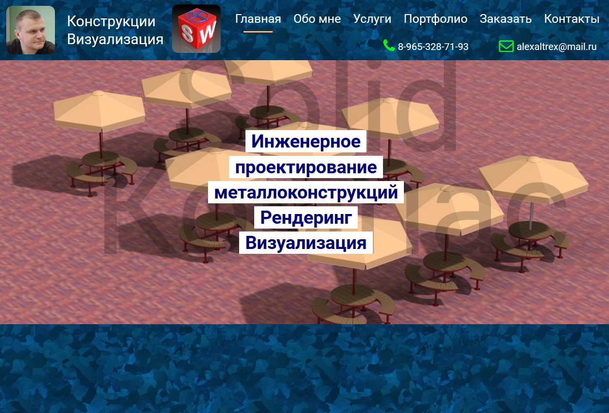

# SolidCompas
Ссылка: https://alexaltrex.github.io/SolidCompas

## Описание
Верстка сайта-портфолио. 

## Запуск проекта:
1. Клонирование и запуск: git clone https://github.com/Alexaltrex/SolidCompas.git;
2. Переход в директорию с проектом: cd SolidCompas;
3. Запуск файла index.html;

## Цель проекта
* Изучение основных паттернов верстки сайтов-порфолио;
* Изучение jQuery, в частности анимации;

## Разработка
* Код - jQuery v.3.4.1;
* Верстка - предпроцессор SASS (конкретно SCSS);
* Адаптивный дизайн, поддержка мобильной версии;

## Структура приложения
1. Заголовок: аниморованный логотип, меню навигации по сайту, контакты.
2. Блок 'Главная': название, задний фон - анимированный слайдер.

3. Блок 'Обо мне': блок мини изображений-ссылок на всплывающее окно с полноформатным изображением, анимированный прелоадер загрузки изображений.
4. Блок 'Услуги': 1-й блок - слайдер (смена изображений на основе изменения прозрачности), 2-й блок - интерактивная анимация на основе 3d-рендеринга, 3-й блок - всплывающее окно с анимированным слайдером (смена изображенийпроисходит за счет перелистывания сегментов, реализовано с помощью canvas).
5. Блок 'Портфолио': массив изображений-ссылок на всплывающее окно со с анимированным слайдером, реализована фильтрация работ по категориям.
6. Блок 'Заказать': Анимированный калькулятор расчета стоимости.
7. Блок 'Контакты'.

